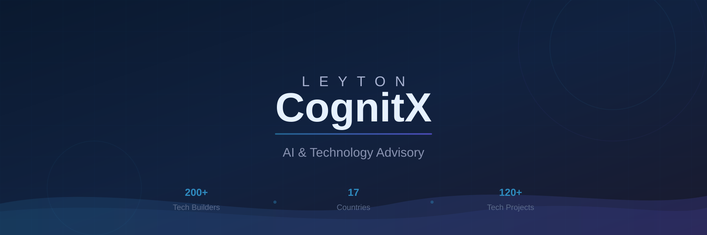

---

### About Us

**Leyton CognitX** unites **200+ tech builders and data scientists** across **17 countries** to deliver cutting-edge AI and tech solutions. From strategic advisory to custom development, we help organizations innovate, automate, and drive impactful change.

---

### What We Do

<table>
<tr>
<td width="50%" valign="top">

**AI Agent Implementation**
Build intelligent, autonomous agents that make decisions and take actions on your behalf

**AI & Machine Learning**
Revolutionize decision-making with cutting-edge ML models

</td>
<td width="50%" valign="top">

**Generative AI**
Deploy enhanced generative AI to optimize business productivity & efficiency

**AI-Powered Product Delivery**
Build and deploy advanced AI-powered digital products at scale

</td>
</tr>
</table>

---

### Our Tech Stack

---

### Open Source Projects

<table>
<tr>
<td width="50%" valign="top">

**[clevexport](https://github.com/cognitx-leyton/clevexport)**
 

Async Excel export for large datasets in Laravel. Process thousands of rows without timeouts.

</td>
<td width="50%" valign="top">

**[ts-odata-v4-server](https://github.com/cognitx-leyton/ts-odata-v4-server)**
 

Full-featured OData V4 server for Node.js with TypeScript support.

</td>
</tr>
<tr>
<td width="50%" valign="top">

**[vue-input-highlighter](https://github.com/cognitx-leyton/vue-input-highlighter)**
 

Vue 3 component for regex-based content highlighting inside inputs.

</td>
<td width="50%" valign="top">

**[laravel-circuit-breaker](https://github.com/cognitx-leyton/laravel-circuit-breaker)**
 

Circuit Breaker pattern for Laravel. Prevent cascading failures in distributed systems.

</td>
</tr>
<tr>
<td width="50%" valign="top">

**[pg-odata-server](https://github.com/cognitx-leyton/pg-odata-server)**
 

PostgreSQL-backed OData V4 server built on ts-odata-v4-server.

</td>
<td width="50%" valign="top">

**Want to contribute?**

We welcome contributions! Check out our repos and open a PR.

</td>
</tr>
</table>

---

### Our Team

**Data Scientists** · **ML Engineers** · **Big Data Engineers** · **Software Engineers** · **Product Designers** · **DevOps & Cybersecurity**

---

